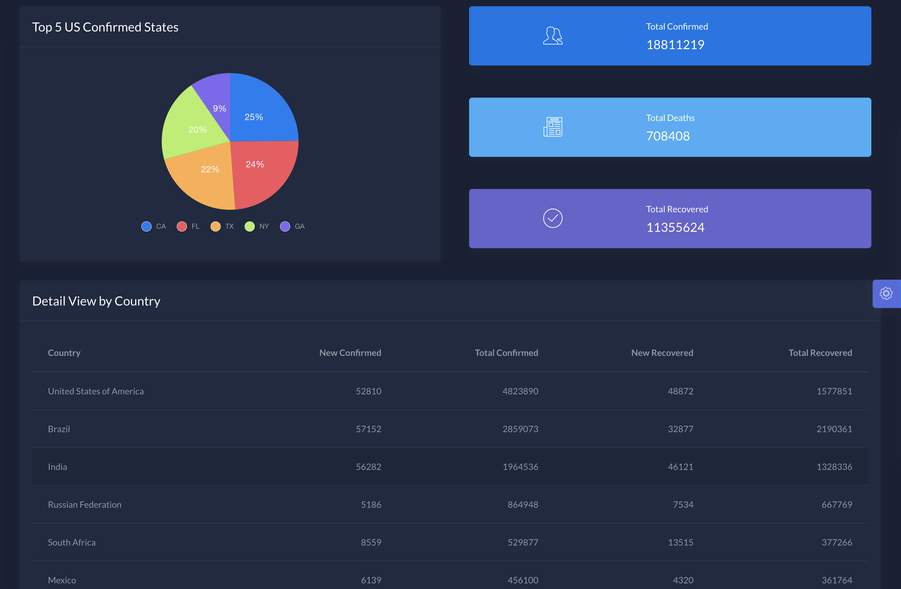
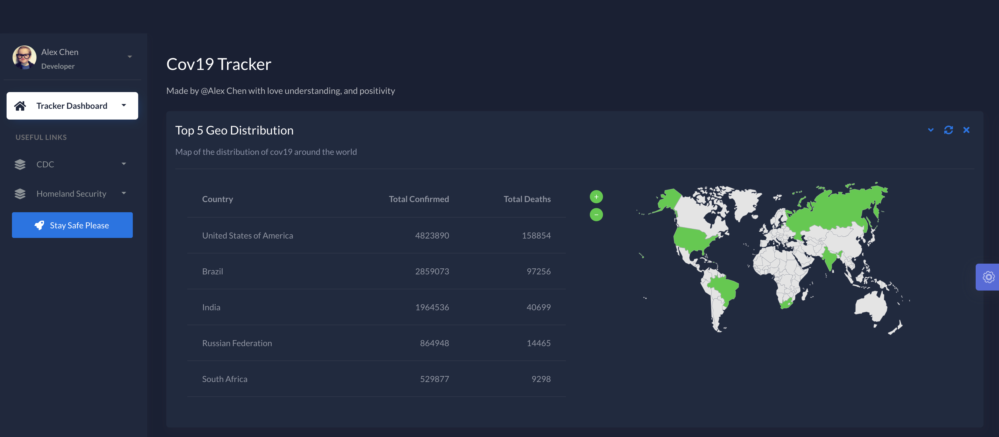
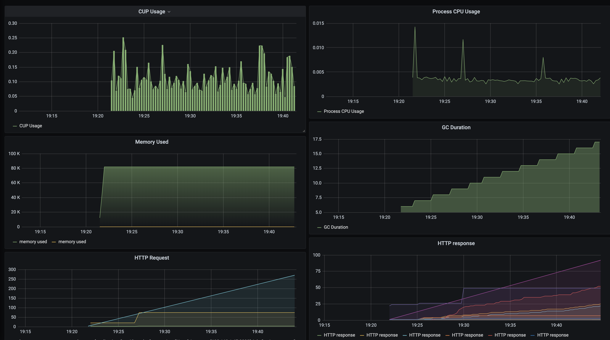

# Cov19 Tracker
---

> GitHub [@Alex Chen](https://github.com/chen-star) &nbsp;&middot;&nbsp;

---

## Demo

#### Tracker Dashboard

#### Monitor Metric Dashboard

## Impl

* **Backend**

	- Spring Boot + MVC as base web framework
	- RestTemplate as Rest Client

* **Frontend**

	- HTML + Thymeleaf as static template
	- Bootstrap + JS as render tool

* **Monitoring**

	- spring-acuator as metric agent inside service
	- Prometheus as data collector
	- Grafana as dashboard UI display